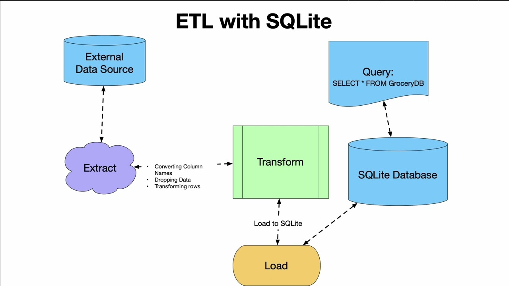
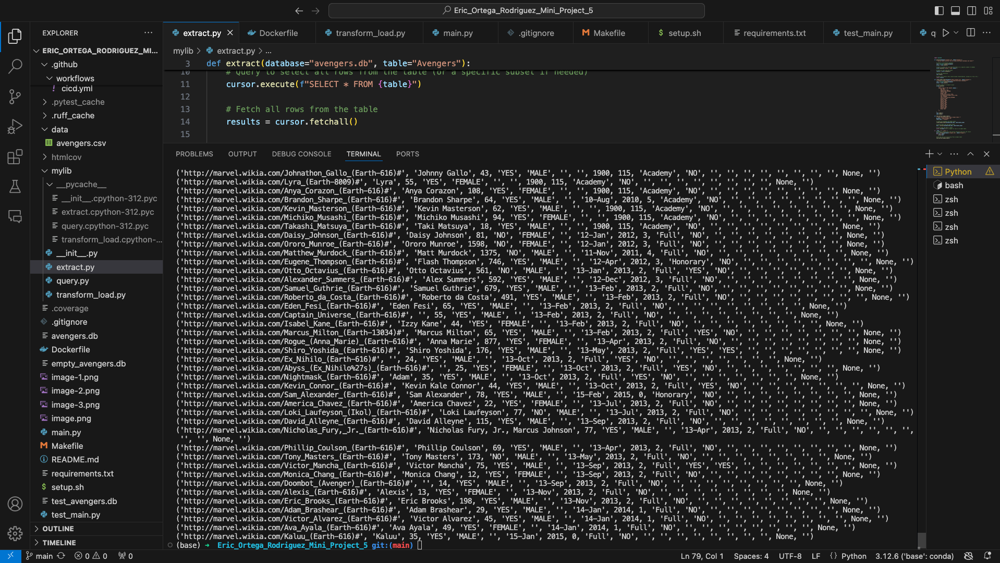
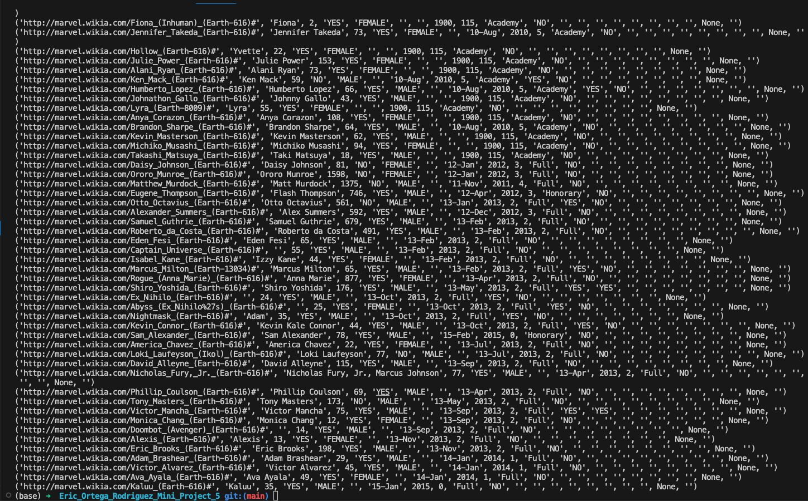
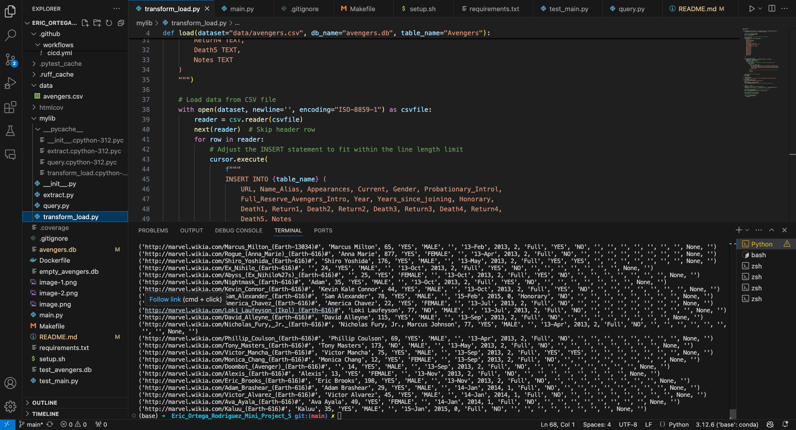

[](https://github.com/nogibjj/Eric_Ortega_Rodriguez_Mini_Project_5/actions/workflows/cicd.yml)
# Eric Ortega Rodriguez Mini Project 5

## Overview

This project is part of our data engineering coursework that covers data operations involving SQL databases and Python. The focus of the project is to demonstrate the ability to connect to a SQL database, perform **CRUD** (Create, Read, Update, Delete) operations, and perform SQL queries. The project also includes a CI/CD pipeline to ensure that the operations work as expected, and it logs the results of successful database operations. The deliverables for the assignment are the Python script and a screenshot of my successful database operations (seen below). I used the avengers dataset which be found [here.](https://github.com/fivethirtyeight/data/tree/refs/heads/master/avengers)



## Requirements
- Connect to a SQL database
- Perform CRUD operations
- Write at least two different SQL queries

## Project Breakdown

```
├── .devcontainer/
│   ├── devcontainer.json
│   └── Dockerfile
│
├── .github/
│   └── workflows/
│       └── cicd.yml
│
├── data/
│   ├── avengers.csv
│   ├── avengers.db
│   ├── empty_avengers.db
│   ├── image-1.png
│   ├── image-2.png
│   ├── image-3.png
│   └── image-4.png
│
├── mylib/
│   ├── __pycache__/
│   │   ├── __init__.cpython-312.pyc
│   │   ├── extract.cpython-312.pyc
│   │   ├── query.cpython-312.pyc
│   │   └── transform_load.cpython-312.pyc
│   ├── __init__.py
│   ├── extract.py
│   ├── query.py
│   └── transform_load.py
│
├── .gitignore
├── Dockerfile
├── image.png
├── main.py
├── Makefile
├── README.md
├── requirements.txt
├── setup.sh
├── test_main.py
└── test_avengers.db

```

## Deliverables 
### 1. Python Script

### 2. Screenshots (See Below)



## References
https://github.com/nogibjj/sqlite-lab